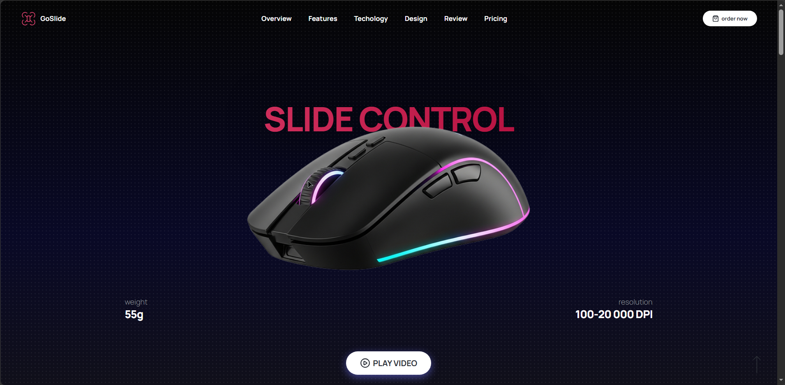
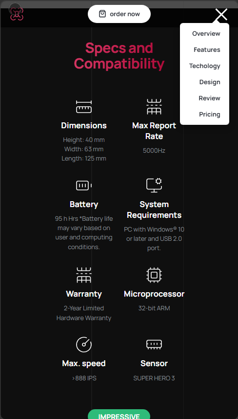
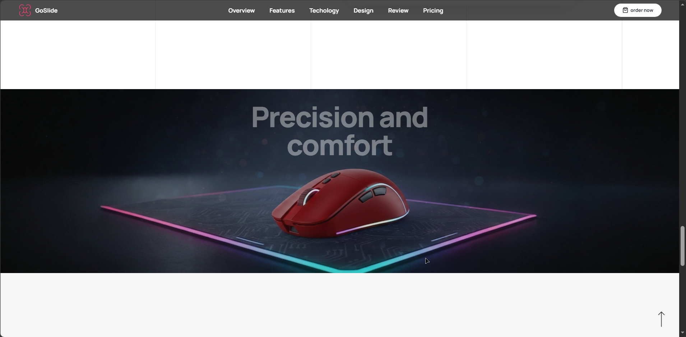
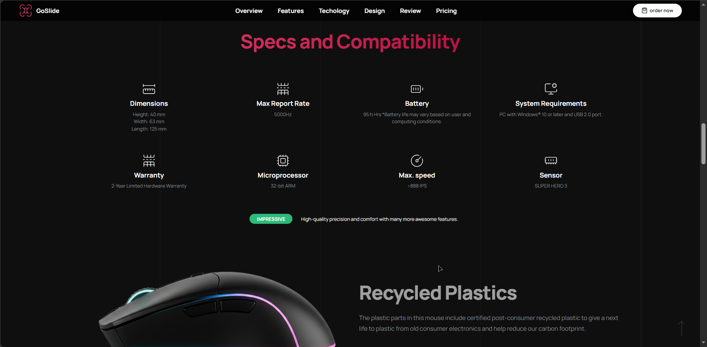
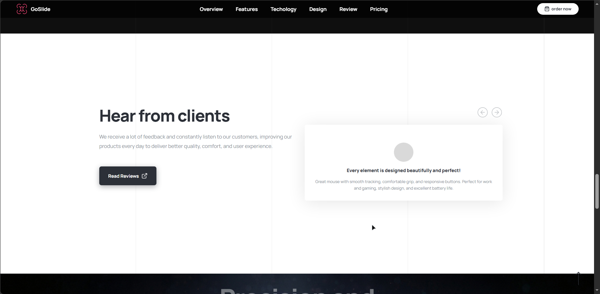
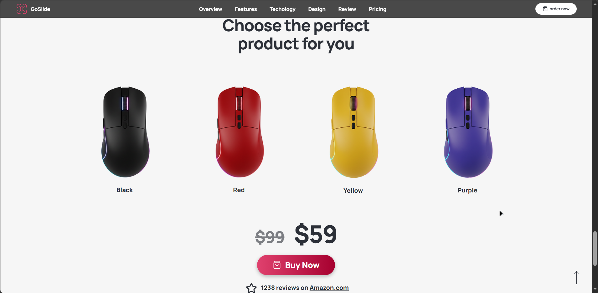
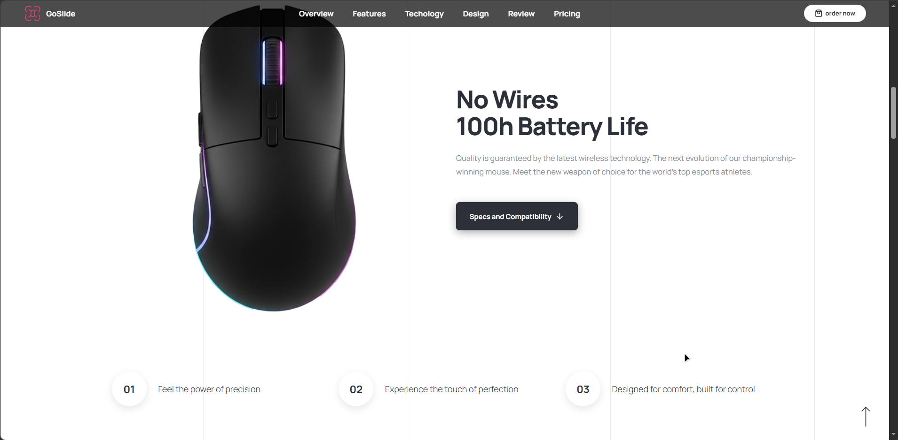

# GoSlide — Landing Page для презентации технологического продукта

## 📌 Описание проекта

GoSlide — современный адаптивный одностраничный сайт, разработанный для презентации и продвижения технологического продукта. Проект ориентирован на демонстрацию преимуществ устройства через удобный интерфейс, интерактивные элементы и качественный пользовательский опыт.

---

## 🎯 Цель проекта

Создать современный маркетинговый лендинг, который:

- привлекает внимание пользователей;
- демонстрирует преимущества продукта;
- обеспечивает удобную навигацию;
- корректно отображается на всех устройствах;
- повышает вовлеченность пользователей за счет интерактивных элементов.

---

## 🚀 Основной функционал

### Для пользователей

- Просмотр информации о продукте
- Навигация по разделам сайта
- Просмотр преимуществ и характеристик
- Просмотр отзывов клиентов
- Работа со слайдерами
- Использование мобильного меню
- Просмотр галереи изображений
- Переход к целевым действиям (CTA)

---

## 🛠 Технологический стек

### Frontend

- HTML5
- CSS3
- JavaScript (ES6)

### Backend

- Не используется

### Database

- Не используется

### Libraries

- Vanilla JavaScript

### Инструменты разработки

- Git
- GitHub
- VS Code

---

## 🏗 Архитектура проекта

```text
project/
│
├── index.html
│
├── css/
│   ├── header.css
│   ├── hero.css
│   ├── gallery.css
│   ├── reviews.css
│   ├── products.css
│   ├── footer.css
│   └── nav.css
│
├── js/
│   ├── slider.js
│   ├── navigation.js
│   ├── reviews.js
│   └── main.js
│
├── assets/
│   ├── images/
│   └── icons/
│
└── README.md
```

### Frontend

- Компонентная структура интерфейса
- Модульное разделение CSS
- JavaScript для интерактивности

### Основные блоки

- Header
- Hero Section
- Benefits
- Product Features
- Gallery
- Reviews
- Pricing
- Footer

---

## ⚙️ Реализованные решения

### Адаптивная верстка

- Поддержка мобильных устройств
- Поддержка планшетов
- Поддержка десктопов

### Пользовательский интерфейс

- Бургер-меню
- Плавная навигация
- Интерактивные элементы
- Слайдеры контента

### Работа с DOM

- Обработка событий
- Динамическое изменение интерфейса
- Управление отображением элементов

### Производительность

- Использование SVG-графики
- Оптимизированная структура файлов
- Минимизация повторяющегося кода

---

## 🧩 Основные задачи проекта

- Разработка адаптивного интерфейса
- Создание удобной навигации
- Реализация интерактивных элементов
- Организация структуры проекта
- Улучшение пользовательского опыта (UX)

---

## 📈 Результат

В результате был создан современный адаптивный лендинг, демонстрирующий навыки:

- HTML5-разметки;
- CSS3-верстки;
- адаптивного дизайна;
- JavaScript-разработки;
- организации структуры фронтенд-проекта;
- работы с пользовательским интерфейсом.

---

## 📸 Скриншоты

### Главная страница



### Мобильная версия



### Галерея



### Технические характеристики



### Отзывы



### Маркет



### Описание


---

## 🔑 ATS Keywords

HTML5 • CSS3 • JavaScript • Responsive Design • Frontend Development • UI Development • Web Development • DOM Manipulation • Adaptive Layout • Git • GitHub • Mobile First • Cross-browser Compatibility • User Interface • Landing Page Development • Flexbox • CSS Grid • Web Performance Optimization
